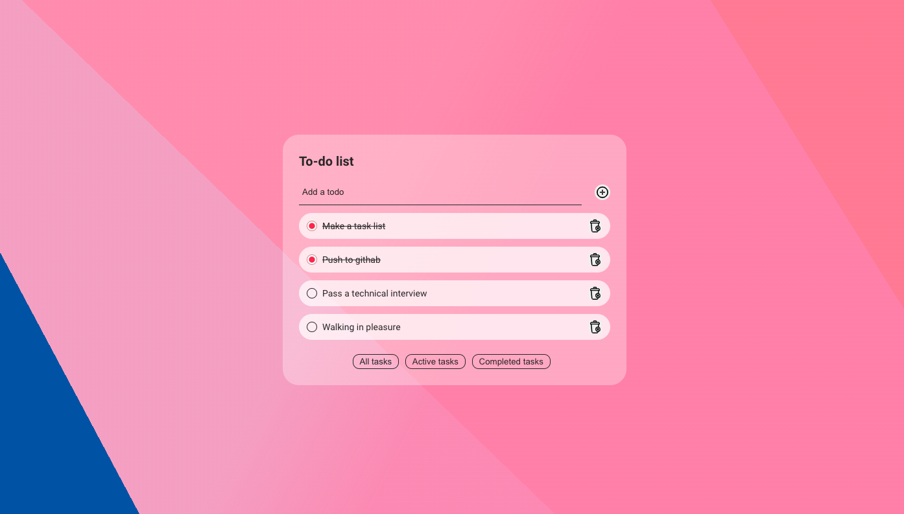

# Todo приложение 

#### Приложение создано с использованием React / TypeScript

#

## Запустить:
### `npm install`
### `npm start`

#

### Функционал:

* Добавление/удаление задач
* Фильтрация задач на:
    - Все
    - Активные
    - Выполненные 

#

